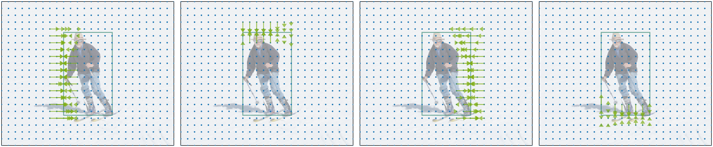

# PDNet: Toward Better One-Stage Object Detection With Prediction Decoupling
A PyTorch implementation of [PDNet: Toward Better One-Stage Object Detection With Prediction Decoupling](https://ieeexplore.ieee.org/document/9844453). 
*IEEE Transactions on Image Processing*, 2022. 


## Introduction

We propose a **P**rediction-target-**D**ecoupled **Net**work (PDNet) for object detection, which decouples the prediction of different targets (*i.e.*, object category and boundaries) into their respective proper positions. The figure below is a visualization of the decoupled regression predictions for object box localization. This allows us to flexibly collect accurate predictions for each object box boundary. For more details on *Prediction Decoupling*, please refer to [our paper](https://ieeexplore.ieee.org/document/9844453).




## Installation
This implementation is based on [maskrcnn-benchmark](https://github.com/facebookresearch/maskrcnn-benchmark), so the installation procedure is pretty much the same. Please check [INSTALL.md](INSTALL.md) for details. Additionally, please remember to build the CUDA implementation of the prediction collection module with the following commands.
```bash
cd pdnet_core/pred_collect_ops
python setup.py build develop
```


## Model Zoo

We provide the following trained models with different backbones or training settings.

Model | Training iterations | Training scales | AP (test-dev) | Link
--- |:---:|:---:|:---:|:---:
PDNet_R_50_FPN_2x | 180k | [640, 800] | 44.3 | [config](configs/pdnet/pdnet_R_50_FPN_2x.yaml) / [weights](https://drive.google.com/file/d/1NQSMtNAoSMFr9GkldDd4mAoNgVgDV5Fx/view?usp=sharing)
PDNet_R_50_FPN_2xx | 180k | [480, 960] | 45.0 | [config](configs/pdnet/pdnet_R_50_FPN_2xx.yaml) / [weights](https://drive.google.com/file/d/150SGwDpUVLpPF9EI-ngJOZ0rQMUGyqxt/view?usp=sharing)
PDNet_R_101_FPN_2x | 180k | [640, 800] | 45.7 | [config](configs/pdnet/pdnet_R_101_FPN_2x.yaml) / [weights](https://drive.google.com/file/d/1zCo6jte_89Z4P_KTQiGBg0IW0d-dZJEW/view?usp=sharing)
PDNet_R_101_FPN_2xx | 180k | [480, 960] | 46.6 | [config](configs/pdnet/pdnet_R_101_FPN_2xx.yaml) / [weights](https://drive.google.com/file/d/1CL0A1S0WtVHL8X-ozvxbpZuUcXOa-2Yp/view?usp=sharing)
PDNet_X_101_64x4d_FPN_2x | 180k | [640, 800] | 47.4 | [config](configs/pdnet/pdnet_X_101_64x4d_FPN_2x.yaml) / [weights](https://drive.google.com/file/d/19InjLGN0SPcGXJglImNlspSaLWK1tG6y/view?usp=sharing)
PDNet_X_101_64x4d_FPN_2xx | 180k | [480, 960] | 48.7 | [config](configs/pdnet/pdnet_X_101_64x4d_FPN_2xx.yaml) / [weights](https://drive.google.com/file/d/1RbEDDH2ArHhoyBFf5SVIvZmjb7bhb02H/view?usp=sharing)

[1] *2x means the model is trained for 180k iterations ($\approx$ 24 epochs)* with multi-scale training ([640, 800]), while 2xx denotes using a wider training scale range [480, 960]. \
[2] Thanks to efficient prediction decoupling, our model has a similar inference time to [FCOS](https://github.com/tianzhi0549/FCOS) while achieving significantly higher accuracy.

## Inference
Evaluate the trained model on the minival split of MS COCO dataset:
```bash
python tools/test_net.py --config-file configs/pdnet/pdnet_R_50_FPN_1x.yaml --ckpt PDNet_R_50_FPN_1x.pth
```
* You can change the arguments of `--config-file` and `--ckpt` to evaluate different models.


## Training
We train our detection model on 4 GPUs with 16 images per minibatch using the following command: 
```bash
python -m torch.distributed.launch --nproc_per_node=4 tools/train_net.py --config-file configs/pdnet/pdnet_R_50_FPN_1x.yaml
```
* We also provide configuration files with different backbones or training settings in [configs/pdnet/](configs/pdnet/).


## Citation
Please cite our paper if this project helps your research.
```
@article{yang2022pdnet,
  title={PDNet: Toward Better One-Stage Object Detection With Prediction Decoupling},
  author={Yang, Li and Xu, Yan and Wang, Shaoru and Yuan, Chunfeng and Zhang, Ziqi and Li, Bing and Hu, Weiming},
  journal={IEEE Transactions on Image Processing},
  volume={31},
  pages={5121--5133},
  year={2022},
  publisher={IEEE}
}
```